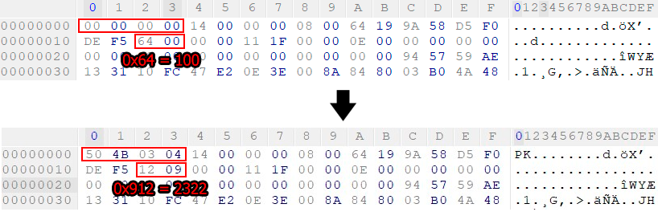

# Решение

В данной задаче нам дан файл без расширения. Взглянув на структуру файла, или использовав утилиту `file`, мы понимаем что это zip архив.  
При открытии архива мы видим внутри 4 файла, два из которых одинаковы. Изучив документацию о структуре zip файла ([пример сайта](https://users.cs.jmu.edu/buchhofp/forensics/formats/pkzip.html)) и сравнив с предоставленным можно заметить несколько странностей:
1) В секции `Central directory` первая запись о файле имеет указатель на смещение `2366` от начала архива, то есть его первая часть совсем не используется.
2) В первой части архива есть данные очень похожие на файл, включая `Local file header` в самом начале архива

Попробуем восстановить заголовок найденного файла в начале архива - добавим magic bytes записи (\x50\x4b\x03\x04), измерим размер сжатых данных и исправим их в заголовке с `100` на `2322`.

Теперь при открытии архиватором с поддержкой битых архивов (например 7-zip) мы можем увидеть новый файл, содержащий в себе флаг. Получившийся после данных манипуляций архив `file_minimal.zip` приложен.

При желании можно окончательно восстановить zip архив, добавив запись о новом файле в секцию `Central directory` и указав имя файла в `Local file header`. После этого архив начнет правильно читаться любым архиватором. Итоговый архив `file_full.zip` приложен.